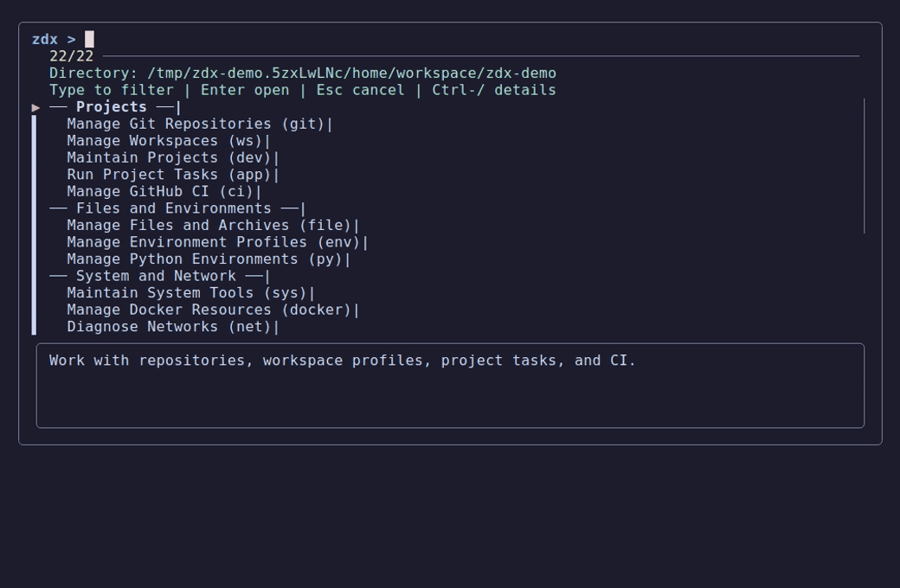

<div align="center">
  
</div>

<br />

<p align="center">
  <a href="https://github.com/landerox/zdx-suite/actions/workflows/lint.yml"></a>
  <a href="https://www.zsh.org/"></a>
  <a href="#prerequisites"></a>
  <a href="https://github.com/junegunn/fzf"></a>
  <a href="https://github.com/landerox/zdx-suite/pulls"></a>
  <br />
  <a href="https://www.bestpractices.dev/en/projects/13195/silver"></a>
  <a href="https://www.bestpractices.dev/en/projects/13195/baseline-2"></a>
  <a href="https://securityscorecards.dev/viewer/?uri=github.com/landerox/zdx-suite"></a>
  <a href="https://github.com/pre-commit/pre-commit"></a>
  <a href="LICENSE"></a>
</p>

Interactive, `fzf`-powered developer workflows and a custom plugin loader for
Zsh, built for Oh My Zsh.

Open `zdx` when you want to explore, or route directly to a suite when you
already know the workflow. The initial `0.1.0` release brings 251 public
commands across 15 suites into one terminal-first interface.

> [!NOTE]
> The initial release consolidates the current suite catalog under `0.1.0`.
> See the [release changelog](CHANGELOG.md) for its scope and verification limits.



The tour highlights Developer project checks, System maintenance, AI assistant
and MCP tools, Git workflows, and File search through ZDX, using filters and
command descriptions without running backend actions. In the menus, `Ctrl-/`
toggles details and `Esc` returns. See the [static Developer preview](.demo/demo.png) or the
[demo transcript and reproduction guide](docs/demo.md).

---

## 🌟 Why ZDX?

- ⚡ **Explore or automate:** Discover workflows through searchable menus, then
  use direct suite commands for repeatable work.
- 🧩 **Load on demand:** Lightweight entrypoints load each suite only when it
  is first used.
- 🔧 **Customize outside the checkout:** Keep settings, overrides, and personal
  plugins under `~/.config/zdx`.
- 🛡️ **Keep trust visible:** Each suite documents its dependencies, supported
  platforms, mutation plans, and authorization model.

---

## 🧰 Included Suites

ZDX provides 15 interactive suites, a plugin manager, and a dependency doctor,
organized into five domains.

### 💻 Projects

- **Git Repositories (`git-menu`)**: Switch among configured Git identities,
  manage branches and stashes, inspect history and diffs, and apply reviewed
  SSH/GPG routing.
- **Workspace Profiles (`ws-menu`)**: Manage isolated profiles, Git `includeIf`
  routing, SSH host aliases, repository placement, and batch migrations.
- **Developer Project Tools (`dev-menu`)**: Run polyglot quality gates, tests,
  and security audits (Bandit, pip-audit) with a consolidated result dashboard;
  update dependency specifiers, lockfiles, and pre-commit hooks; and clean
  project caches with an exact removal plan, dry-run, and confirmation.
- **Project Tasks (`app-menu`)**: Discover bounded tasks from reviewed
  `Justfile`, `package.json`, `Makefile`, and Compose descriptors, then run one
  exact rediscovered target through a fixed backend with dry-run and explicit
  non-interactive authorization controls.
- **CI/CD Workflows (`ci-menu`)**: Inspect bounded GitHub Actions records,
  dispatch one revalidated workflow/ref, and clean exact repository-bound
  runs, deployments, releases, or notifications with dry-run and confirmation.

### 🧪 Files and Environments

- **File & Archive Utilities (`file-menu`)**: Create staged TAR, ZIP, or 7z
  archives; safely preflight and extract GNU TAR archives; and run bounded
  search, bulk-operation, permission, checksum, Base64, diff, and line-ending
  workflows below the current directory.
- **Environment & Dotenv (`env-menu`)**: Passively parse reviewed `.env` data
  without `source` or `eval`, manage private atomic profiles, inspect masked
  session variables, and explicitly deduplicate `$PATH`.
- **Python & Virtualenvs (`py-menu`)**: Manage validated project-local virtual
  environments, install or pin uv-managed runtimes, inspect PyPI, change
  project packages without ambient `pip`, and manage isolated `uv tool` or
  `pipx` applications.

### 🖥️ System and Network

- **System Operations (`sys-menu`)**: Run portable diagnostics, inspect typed
  process/port/service records, and execute capability-aware updates, cleanup,
  backups, and restores with dry-run, confirmation, and target revalidation.
- **Docker Resources (`docker-menu`)**: Inspect typed container and image
  inventories, operate on revalidated full IDs, manage a reviewed Compose
  descriptor, and clean exact resources with dry-run and confirmation.
- **Network Diagnostics (`net-menu`)**: Run bounded local-interface, routing,
  latency, DNS, and fixed-provider public-IP diagnostics; bandwidth-consuming
  speed tests require an explicit reviewed authorization.
- **WireGuard VPN (`vpn-menu`)**: Toggle WireGuard tunnels interactively or from
  the CLI, manage profiles with confirmable plans and dry runs, edit them through
  `sudoedit` so your editor never runs as root, and apply validated WSL DNS leak
  protection.

### 🤖 AI and Hardware

- **AI Assistant & MCP (`ai-menu`)**: Inspect local assistants and MCP
  declarations, quarantine reviewed cache targets, consolidate workspace
  instructions, manage private snapshots, and review and run official
  self-updaters for installed Claude, Codex, Antigravity, OpenCode, Cursor,
  Copilot, Amp, and Hermes CLIs. Discovery can passively resolve a protected
  standard NVM default installation without loading NVM or executing lazy
  wrappers.
- **Hugging Face Hub (`hf-menu`)**: Use an already-installed compatible
  `huggingface_hub` backend to search models/datasets, inspect bounded metadata,
  download explicit files or snapshots, and remove one validated cache entry.
- **NVIDIA GPU Visualizer (`gpu-menu`)**: Monitor validated, timeout-bounded
  NVIDIA telemetry and process occupancy, or opt into clearly labelled
  synthetic data with `--simulate`; continuous rendering remains bound to the
  foreground terminal.

### 🧩 ZDX Tools

- **Dependency Diagnostics (`zdx doctor` / `zdx-doctor`)**: Run OS-aware
  capability checks and opt in explicitly before any supported dependency
  installation.
- **Plugin Manager CLI (`zdx-plugins`)**: Discover and manage structurally
  validated custom menus under `~/.config/zdx/plugins`; their source and origin
  still require your review and trust. Its legacy capture and lifecycle limits
  remain documented in the [security assessment](docs/security-assessment.md).

---

## 🚀 Getting Started

### 🌍 Supported Environments

| Platform | Status | Integration Notes |
| :--- | :---: | :--- |
| **Linux (Ubuntu, Debian, Fedora, etc.)** | ✅ Primary | Primary target; individual commands remain capability-dependent. |
| **Windows 11 / 10 (WSL2)** | ✅ Supported | Linux/WSL paths are available; systemd and networking features require host capabilities. |
| **macOS (Darwin)** | ⚠️ Conditional | Core Zsh workflows can run; Linux-specific System/VPN actions are unavailable. |
| **FreeBSD** | 🧪 Experimental | Core behavior may work, but the repository has no dedicated CI coverage. |
| **Android (Termux)** | 🧪 Experimental | Lightweight commands may work; privileged and service workflows vary. |

### 🛠️ Prerequisites

Install the small core first; each suite checks its own additional capabilities
only when you use them.

- [Zsh](https://www.zsh.org/), [Oh My Zsh](https://ohmyz.sh/), Git,
  [`fzf`](https://github.com/junegunn/fzf) 0.31 or newer for responsive
  previews, and `jq`.
- Python 3.8 or newer for the local installer; Bash 3.2 or newer only when using its
  compatibility launcher.
- Suite-specific tools only when needed, such as `gh`, Docker, `wg-quick`,
  `uv`, `pipx`, or `nvidia-smi`.

Run `zdx doctor` after installation. In addition to command presence, it checks
the alternative `timeout`/`gtimeout` and `sha256sum`/`shasum` capabilities,
Network probe tools, `findmnt`, the active GNU `tar`, and an already-installed
compatible `huggingface_hub`; suite-specific capabilities are reported but
never bootstrapped implicitly. It also reports terminal settings, fzf version
probe failures, and the loaded doctor's source path without printing theme or
fzf option values.

### ⚡ Installation

Install from a local checkout whose code you have reviewed. The installer
links that checkout into Oh My Zsh, creates an optional private configuration
when absent, and prints activation instructions. It does not download code,
update repositories, install dependencies, or edit your shell startup file.

#### 1. Obtain and review the source

```sh
git clone https://github.com/landerox/zdx-suite.git "$HOME/zdx-suite"
cd "$HOME/zdx-suite"
```

Review the checkout, including `scripts/install.sh`, `scripts/install.zsh`,
`scripts/install_fs.py`, `zdx-suite.plugin.zsh`, and `functions.zsh`, before
running or loading it.
Cloning the mutable default branch is a trust decision, not cryptographic
verification. See the [installation contract](docs/installation.md) for source
review, alternative layouts, and remaining trust limits.

#### 2. Review and apply the local plan

Pass your Oh My Zsh paths explicitly to the child process; an unexported Zsh
variable is not inherited by an installer:

```zsh
export ZSH="${ZSH:-$HOME/.oh-my-zsh}"
export ZSH_CUSTOM="${ZSH_CUSTOM:-$ZSH/custom}"
export ZDOTDIR="${ZDOTDIR:-$HOME}"
zsh -f scripts/install.zsh --dry-run
zsh -f scripts/install.zsh
```

The second command requires confirmation. For unattended installation, review
the same plan first and pass `--yes` explicitly. `bash scripts/install.sh`
forwards the same flags to Zsh; it must also run from the reviewed local tree.
Existing unrelated destinations are preserved and refused. Re-running with the
same checkout preserves the existing link or in-place installation and valid
configuration; it does not update source code.

#### 3. Enable the plugin and open a fresh shell

In the startup file printed by the installer (`${ZDOTDIR:-$HOME}/.zshrc`), add
`zdx-suite` to the existing `plugins` array **before** the line that sources
Oh My Zsh. Preserve your other plugins:

```zsh
plugins=(
  # ... your other plugins
  zdx-suite
)
source "$ZSH/oh-my-zsh.sh"
```

Do not add a second Oh My Zsh source line if one already exists. Start a new
terminal or replace the current shell so loaded-function guards do not retain
old definitions:

```zsh
exec zsh
```

Once loaded, you can control your entire suite through the unified **`zdx`** command wrapper, or by calling individual menus directly.

---

## 🕹️ Usage & Command Architecture

ZDX is designed to adapt to your personal terminal workflow. You have complete flexibility in how you invoke your tools:

### 1. 🎛️ The Unified `zdx` Wrapper

Type `zdx` to explore every built-in suite and loaded custom plugin from one
searchable menu. Use a subcommand to route directly when you already know the
destination:

```sh
zdx                 # Launches the master FZF control menu
zdx git             # Runs git-menu
zdx vpn             # Runs vpn-menu
zdx docker          # Runs docker-menu
zdx doctor          # Runs the dependency diagnostics and installer assistant
zdx --help          # Shows the unified ZDX CLI help
```

The catalog groups suites by responsibility and displays their route tokens,
so typing `app`, `ws`, or `net` finds that destination. Command menus share a
compact list with the selected action's description below it; `Ctrl-/` toggles
details where advertised. App and VPN retain their task and tunnel views.
See the [menu design decision](docs/menu-design.md) for the comparison and
the [menu controls guide](docs/user-guide.md#──-general-menu-controls-fzf-──)
for navigation.

### 2. 🧭 Direct Menu Invocation

Every suite's primary entrypoint is registered directly in your shell environment. If you know what you want, run it directly:

```sh
git-menu            # Directly open Git repository actions
docker-menu         # Directly launch the Docker Container Dashboard
py-menu             # Directly open the Python environment manager
```

### 3. ⌨️ Personalized Aliases

Create simple, custom aliases in your shell profile (`~/.zshrc`) to bind your favorite menus to short commands:

```sh
alias g=git-menu    # Open Git menu with 'g'
alias v=vpn-menu    # Open WireGuard VPN manager with 'v'
alias d=docker-menu # Open Docker container dashboard with 'd'
alias z=zdx         # Access the master control menu with 'z'
```

---

## ⚙️ Configuration & Customization

### 🔧 Base Configuration

ZDX works without a user configuration file. The local installer copies the
commented template only when `~/.config/zdx/config.zsh` is absent and preserves
an existing valid file. Use its preview and confirmation workflow above when
setting up configuration; it refuses unsafe paths instead of overwriting them.
Uncomment only the settings you need.

The tracked template lives at `.config/zdx/config.zsh.example`; the installed
copy remains `~/.config/zdx/config.zsh`.

> [!IMPORTANT]
> `config.zsh`, `overrides.zsh`, and plugin entrypoints are executable Zsh loaded
> into your current shell. Keep them owner-controlled and review every line
> before loading it.

Open `~/.config/zdx/config.zsh` to configure workspace roots, Git identities,
the shared theme, opt-in telemetry, or documented suite settings.

Menus default to a 16-color palette with the terminal's own foreground and
background. For difficult-to-see entries, try `ZDX_FZF_PLAIN=1 file-menu` or
`ZDX_FZF_PLAIN=1 zdx`: any nonempty value disables color and uses ASCII fzf
borders and indicators. Row text may still contain Unicode. `NO_COLOR` forces
color off even with a custom theme. Built-in pickers isolate inherited fzf
defaults without changing your shell environment.

See [terminal rendering and recovery](docs/user-guide.md#terminal-rendering-and-recovery)
for locale behavior, diagnostics, and terminal limits. Native macOS
Terminal.app/iTerm2 light/dark validation remains manual; rendering changes do
not expand suite-specific OS support.

### 🔒 Update-Safe Customizations

Keep personal behavior outside the plugin checkout so source updates do not
overwrite it or create avoidable merge conflicts.

1. **Settings:** Put documented values in `~/.config/zdx/config.zsh`.
2. **Function and alias overrides:** Put trusted Zsh in
   `~/.config/zdx/overrides.zsh`; it is loaded last.
3. **Custom tools:** Build reviewed plugins under `~/.config/zdx/plugins/` and
   follow the plugin contract below.

ZDX does not run background update checks. Package, plugin, toolchain, and
installed AI CLI updates occur only when you invoke their documented commands
and authorize the displayed plan.

---

## 🔌 Custom Plugins

Add a custom interactive tool by creating a matching directory and entrypoint
under `~/.config/zdx/plugins/`. The loader validates the path, ownership,
structure, and Zsh syntax before registering the expected menu function; those
checks establish compatibility, not safety.

> [!WARNING]
> Plugin entrypoints are executable Zsh sourced into your current shell; they
> are not sandboxed. Review and trust the source and update origin before
> loading a plugin.

```sh
~/.config/zdx/plugins/
└── infra/
    └── infra-menu.zsh  # Defines infra-menu() function
```

Manage your custom suites easily using the interactive plugin manager:

```sh
zdx plugins             # Launch the interactive plugin manager
zdx-plugins --list      # List installed custom plugins
```

See [docs/plugins.md](docs/plugins.md) for the full Plugin Ecosystem Contract and namespace safety guidelines.

---

## 🛡️ Security

ZDX runs inside your current Zsh session. Local configuration, overrides,
custom plugins, vendor updaters, and project task descriptors are trusted-code
boundaries rather than sandboxed data. Review them before use and consult each
suite contract before automating a mutating command.

Report vulnerabilities privately through the
[security policy](.github/SECURITY.md). Never disclose a vulnerability in a
public issue.

---

## 💬 Support & Feedback

- Report reproducible problems through the
  [bug report](.github/ISSUE_TEMPLATE/bug_report.yml).
- Propose focused improvements through the
  [feature request](.github/ISSUE_TEMPLATE/feature_request.yml).
- Include your platform, Zsh version, `zdx --version`, and the smallest useful
  reproduction.

---

## 🤝 Contributing

Contributions are welcome. Start with the repository contracts and keep each
change focused on one owning suite or toolchain surface.

Common dev commands (run `just --list` for the full set):

```sh
just sync                 # install dev deps (commitizen, pre-commit, pip-audit) via uv
just check                # lock freshness + syntax + hooks + audit + full BATS suite
just fmt                  # format .zsh files with shfmt (when installed)
just audit                # pip-audit against Python dev deps for CVEs
just secrets              # gitleaks scan over the working tree
just check-ci [workflow]  # smoke-run a workflow via act (skipped if act/Docker missing)
just demo                 # regenerate the README demo (see docs/demo.md)
```

> [!CAUTION]
> `just retag <version>` deletes and recreates release state locally and on
> GitHub. It is a maintainer-only publication command, not a routine development
> task.

Code quality is enforced via `pre-commit` hooks (gitleaks, markdownlint,
actionlint, zizmor, shellcheck, conventional commits, `zsh -n`), a pre-push
`just check` gate, and the CI `lint` + `dco` workflows on every pull request.
The CI Quality Gates workflow invokes the same `just check` aggregate used
locally, with Zsh, BATS, fzf, and Just installed so native fzf checks run too.
Pipe-delimited pickers use an explicit literal separator compatible with the
Ubuntu distribution binary and newer fzf releases.
Its first step refuses stale project metadata without rewriting
`uv.lock`, and every contributor-tool invocation is locked. Every commit must
include a Developer Certificate of Origin sign-off
(`git commit -s`). Release source archives include a SHA-256 checksum and
Sigstore-backed GitHub build provenance; verification instructions live in
[`.github/SECURITY.md`](.github/SECURITY.md).

For branch naming, conventional-commit scopes, and the full contributor checklist, see [`.github/CONTRIBUTING.md`](.github/CONTRIBUTING.md).

For the canonical suite architecture, command, safety, and interactive-menu
contracts, see [`docs/development.md`](docs/development.md) and
[`docs/menu-spec.md`](docs/menu-spec.md).

---

## 💡 The Inspiration

```text
Hello everybody out there using zsh -

I'm doing a (free) developer experience plugin (just a hobby, won't be
big and professional like ohmyzsh). This has been brewing since May,
and is starting to get ready. I'd like any feedback on things people
like/dislike.
```

— *A nod to Linus Torvalds' 1991 Linux announcement.*

*ZDX started exactly like this: a personal hobby born out of frustration with daily terminal workflows.* Like many developers, my routine involved constantly jumping between Docker containers, switching Git profiles, toggling WireGuard VPN tunnels, and resolving locked ports. I found myself writing, copying, and memorizing the same complex commands every single day.

To solve this, I built a set of lightweight, modular Zsh helpers powered by `fzf` interactive menus. It was designed to do one thing: get me from thought to execution in a single keystroke. Once it started saving me real time, I decided to open-source it, hoping it would help other terminal power users streamline their daily workflows too.

---

> **🤖 Note for AI Coding Assistants:** Please read [AGENTS.md](AGENTS.md) for architectural guidelines, system rules, and a roadmap of the `docs/` directory before making any changes.
