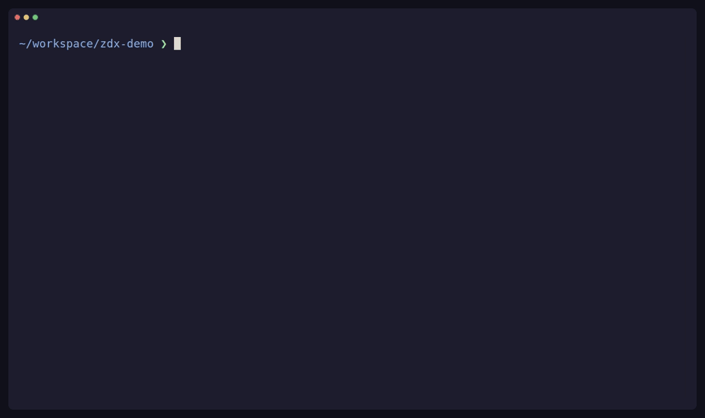

<div align="center">
  
</div>

<br />

<p align="center">
  <a href="https://github.com/landerox/zdx-suite/actions/workflows/lint.yml"></a>
  <a href="https://github.com/landerox/zdx-suite/releases/latest"></a>
  <a href="https://www.zsh.org/"></a>
  <a href=".python-version"></a>
  <a href="https://github.com/junegunn/fzf"></a>
  <a href="#prerequisites"></a>
  <a href="#prerequisites"></a>
  <a href="#prerequisites"></a>
  <a href="LICENSE"></a>
  <br />
  <a href="https://github.com/landerox/zdx-suite/actions/workflows/macos.yml"></a>
  <a href="https://securityscorecards.dev/viewer/?uri=github.com/landerox/zdx-suite"></a>
  <a href="https://github.com/pre-commit/pre-commit"></a>
  <a href="https://www.bestpractices.dev/en/projects/13195/silver"></a>
  <a href="https://www.bestpractices.dev/en/projects/13195/baseline-2"></a>
</p>

Interactive, `fzf`-powered developer workflows and a custom plugin loader for
Zsh, built for Oh My Zsh.

Open `zdx` when you want to explore, or route directly to a suite when you
already know the workflow. Eight suites, a dependency doctor, and a plugin
manager share one terminal-first interface.



The tour opens the `zdx` launcher, saves unfinished work as a stash from the
Git menu after showing its exact plan, summarizes the host from the System
menu, and checks a Python project's health from the Developer menu. It runs in
a private workspace. In the menus, type to filter, `Ctrl-/` toggles details,
and `Esc` returns. See the [static Git menu](.demo/demo.png) or the
[demo transcript and reproduction guide](docs/demo.md).

---

## 🌟 Why ZDX?

- ⚡ **Explore or automate:** Discover workflows through searchable menus, then
  use direct suite commands for repeatable work.
- 🧩 **Load on demand:** Lightweight entrypoints load each suite only when it
  is first used.
- 🔧 **Customize outside the checkout:** Keep settings, overrides, and personal
  plugins under `~/.config/zdx`.
- 🛡️ **Keep trust visible:** Each suite documents its dependencies, supported
  platforms, mutation plans, and authorization model.

---

## 🧰 Included Suites

ZDX provides eight interactive suites, a status dashboard, a plugin manager,
and a dependency doctor, organized into four domains.

### 💻 Projects

- **Workspaces (`ws-menu`)**: Jump the current shell to any repository in your
  `~/workspaces/<platform>/<identity>/<repository>` layout; clone a URL into
  the right workspace after an exact plan, using the workspace's SSH alias and
  applying its Git identity profile; and review branch, changes, ahead/behind,
  and stashes across every repository, optionally after a disclosed, bounded
  fetch or as JSON.
- **Git Repositories (`git-menu`)**: Check repository status, also as JSON;
  unstage files, manage stashes, and amend the last commit; switch branches,
  carrying or stashing uncommitted work after review, and restore lost commits
  as new branches; discard selected or all local changes after an exact plan;
  pull and push with exact remote leases; create, verify, and publish tags;
  create and check out pull requests; clean up merged branches; and switch
  among configured Git identities with reviewed SSH/GPG routing, check a
  workspace repository against its identity, or opt in to a warning on `cd`.
- **Developer Project Tools (`dev-menu`)**: Run Python and Terraform quality
  gates (Ruff, type checking, TFLint) plus ShellCheck and Markdownlint, tests,
  and security audits (Bandit, pip-audit) with a consolidated result dashboard;
  update dependency specifiers, lockfiles, and pre-commit hooks; pin the
  GitHub Actions in your workflows to newer release SHAs within their major
  version; and clean project caches with an exact removal plan, dry-run, and
  confirmation.

### 🧪 Files and Environments

- **File & Archive Utilities (`file-menu`)**: Create staged TAR, ZIP, or 7z
  archives; safely preflight and extract GNU TAR archives; find large files
  below the current directory, optionally deleting them through a reviewed
  quarantine plan; move paths to a private trash and restore them without
  overwriting anything, or purge them later; and remove junk files such as
  `*:Zone.Identifier`, `.DS_Store`, and `Thumbs.db` after reviewing the exact
  plan.
- **Environment Variables (`env-menu`)**: Browse session variables with masked
  values, copy one exact value without printing it, inspect or explicitly
  deduplicate `$PATH`, and check a project's `.env` against its example by key
  name, with Git and permission hygiene, without ever showing a value.
- **Python & Virtualenvs (`py-menu`)**: Manage validated project-local virtual
  environments, install or pin uv-managed runtimes, inspect PyPI, change
  project packages without ambient `pip`, and manage isolated `uv tool` or
  `pipx` applications.

### 🖥️ System and VPN

- **System Operations (`sys-menu`)**: Run portable diagnostics, review the
  WSL configuration, inspect typed process/port/service records, and execute
  capability-aware updates and cleanup with dry-run, confirmation, and target
  revalidation.
- **WireGuard VPN (`vpn-menu`)**: Toggle WireGuard tunnels on Linux, WSL, and
  macOS (through Homebrew `wireguard-tools`) interactively or from the CLI,
  manage profiles with confirmable plans and dry runs, edit them so your editor
  never runs as root, apply validated WSL DNS leak protection, and measure the
  path MTU to size the tunnel and the network interface.

### 🧩 ZDX Tools

- **Status Dashboard (`zdx status` / `zdx-status`)**: See the repository,
  project, VPN, host, and ZDX state on one read-only screen, or as one
  `zdx.status.v1` JSON document with `--json`.
- **Dependency Diagnostics (`zdx doctor` / `zdx-doctor`)**: Run OS-aware
  capability checks and opt in explicitly before any supported dependency
  installation.
- **Plugin Manager CLI (`zdx-plugins`)**: Discover and manage structurally
  validated custom menus under `~/.config/zdx/plugins`. Installs and updates
  are staged, validated, and activated only after a trust decision that shows
  the origin and the exact commits, and a failed activation rolls back. Plugin
  code still requires your review and trust; see the
  [security assessment](docs/security-assessment.md).

---

## 🚀 Getting Started

### 🌍 Supported Environments

| Platform | Status | Integration Notes |
| :--- | :---: | :--- |
| **Linux (Ubuntu, Debian, Fedora, etc.)** | ✅ Primary | Primary target. The Quality Gates workflow runs the full test suite on Ubuntu; individual commands remain capability-dependent. |
| **Windows 11 / 10 (WSL2)** | ✅ Supported | Linux behavior plus WSL handling: on a Windows drive (DrvFs) without metadata, File refuses mutations, Python refuses projects, and Developer refuses its private state, each explaining the `/etc/wsl.conf` remedy, while Git works there with a speed and line-ending advisory; Windows programs on the appended `PATH` do not count as Linux tools; clipboard copies reach `clip.exe` as UTF-16; and the VPN suite adds DNS hardening. These branches are tested through mocks and fixtures; no WSL host runs in CI, and WSL1 is unverified. |
| **macOS (Apple Silicon and Intel)** | ✅ Supported | With Homebrew tools, listed under Prerequisites below. A CI job runs the full test suite on an Apple Silicon runner with the BSD userland, and a VPN smoke job brings a real WireGuard tunnel up and down. Host-only behavior, such as launchd, `softwareupdate`, Homebrew casks, and sudo timestamp renewal, is covered by mocks; Intel Macs and Terminal.app/iTerm2 rendering are not verified. Commands that cannot apply, such as `update-apt`, say so. |

Other systems, such as FreeBSD or Android (Termux), are not supported and have
no CI coverage. Some commands may work there, but the VPN suite refuses
them unless you set `VPN_CONFIG_DIR` explicitly.

### 🛠️ Prerequisites

Install the small core first; each suite checks its own additional capabilities
only when you use them.

- [Zsh](https://www.zsh.org/), [Oh My Zsh](https://ohmyz.sh/), Git (2.31 or
  newer for `git-menu` and `ws-menu`), [`fzf`](https://github.com/junegunn/fzf)
  0.31 or newer for responsive previews, and `jq`.
- Python 3.8 or newer for the local installer; Bash 3.2 or newer only when using its
  compatibility launcher.
- Suite-specific tools only when needed, such as `gh`, `wg-quick`, `uv`, or
  `pipx`; [`fd`](https://github.com/sharkdp/fd) optionally speeds up
  workspace discovery, which otherwise uses `find`.

Per platform:

- **macOS** (Apple Silicon or Intel): install the core tools with Homebrew
  (`brew install fzf jq`, plus `gh` and `uv` when you use pull requests or the
  Python suite). Apple's Git and Python from the Command Line Tools
  (`xcode-select --install`) are new enough for `git-menu` and the installer,
  or install Homebrew `git` and Python. The VPN suite needs
  `brew install wireguard-tools bash`, because wg-quick needs Bash 4 or newer;
  `file-extract` needs `brew install gnu-tar`, which adds `gtar`; and 7z
  creation needs Homebrew `sevenzip`. `timeout` is optional: a built-in
  watchdog bounds probes without it, and the suites prefer `gtimeout` when
  Homebrew `coreutils` is installed.
- **Linux and WSL2**: install the same tools from your distribution, with
  `wireguard-tools` for the VPN suite; GNU `tar` and `timeout` are usually
  already present. Ubuntu 20.04's Git 2.25 is too old for `git-menu`. On WSL,
  keep repositories and projects in the Linux filesystem rather than below
  `/mnt`.
- **Developer metadata** needs Python 3.11 or newer for `tomllib` on every
  platform. The suite finds it among `python3`, `python3.14` through
  `python3.11`, a uv-managed Python, and the project's `.venv`, so an older
  default `python3`, such as 3.9 on macOS or 3.10 on Ubuntu 22.04, can stay.

Run `zdx doctor` after installation. In addition to command presence, it checks
the alternative `timeout`/`gtimeout` and `sha256sum`/`shasum` capabilities,
the optional `fd` or `fdfind` for workspace discovery, `ip` for VPN routes,
and GNU `tar` as `tar` or `gtar`, showing rows
that do not apply on the platform as not applicable; suite-specific
capabilities are reported but never bootstrapped implicitly. It also reports terminal settings, fzf version
probe failures, and the loaded doctor's source path without printing theme or
fzf option values.

### ⚡ Installation

Install from a local checkout whose code you have reviewed. The installer
links that checkout into Oh My Zsh, creates an optional private configuration
when absent, and prints activation instructions. It does not download code,
update repositories, install dependencies, or edit your shell startup file.

#### 1. Obtain and review the source

```sh
git clone https://github.com/landerox/zdx-suite.git "$HOME/zdx-suite"
cd "$HOME/zdx-suite"
```

Review the checkout, including `scripts/install.sh`, `scripts/install.zsh`,
`scripts/install_fs.py`, `zdx-suite.plugin.zsh`, and `functions.zsh`, before
running or loading it.
Cloning the mutable default branch is a trust decision, not cryptographic
verification. See the [installation contract](docs/installation.md) for source
review, alternative layouts, and remaining trust limits.

#### 2. Review and apply the local plan

Pass your Oh My Zsh paths explicitly to the child process; an unexported Zsh
variable is not inherited by an installer:

```zsh
export ZSH="${ZSH:-$HOME/.oh-my-zsh}"
export ZSH_CUSTOM="${ZSH_CUSTOM:-$ZSH/custom}"
export ZDOTDIR="${ZDOTDIR:-$HOME}"
zsh -f scripts/install.zsh --dry-run
zsh -f scripts/install.zsh
```

The second command requires confirmation. For unattended installation, review
the same plan first and pass `--yes` explicitly. `bash scripts/install.sh`
forwards the same flags to Zsh; it must also run from the reviewed local tree.
Existing unrelated destinations are preserved and refused. Re-running with the
same checkout preserves the existing link or in-place installation and valid
configuration; it does not update source code.

#### 3. Enable the plugin and open a fresh shell

In the startup file printed by the installer (`${ZDOTDIR:-$HOME}/.zshrc`), add
`zdx-suite` to the existing `plugins` array **before** the line that sources
Oh My Zsh. Preserve your other plugins:

```zsh
plugins=(
  # ... your other plugins
  zdx-suite
)
source "$ZSH/oh-my-zsh.sh"
```

Do not add a second Oh My Zsh source line if one already exists. Start a new
terminal or replace the current shell so loaded-function guards do not retain
old definitions:

```zsh
exec zsh
```

Once loaded, you can control your entire suite through the unified **`zdx`** command wrapper, or by calling individual menus directly.

---

## 🕹️ Usage & Command Architecture

ZDX is designed to adapt to your personal terminal workflow. You have complete flexibility in how you invoke your tools:

### 1. 🎛️ The Unified `zdx` Wrapper

Type `zdx` to explore every built-in suite and loaded custom plugin from one
searchable menu. Use a subcommand to route directly when you already know the
destination:

```sh
zdx                 # Launches the master FZF control menu
zdx git             # Runs git-menu
zdx ws              # Runs ws-menu
zdx vpn             # Runs vpn-menu
zdx sys             # Runs sys-menu
zdx status          # Shows a read-only repository, project, VPN, and host summary
zdx status --json   # Prints the same summary as one zdx.status.v1 JSON document
zdx doctor          # Runs the dependency diagnostics and installer assistant
zdx --help          # Shows the unified ZDX CLI help
```

`zdx status` reads only local, bounded probes: it never fetches, uses the
network, or asks for privileges. Its `--json` form follows the shared
[JSON output convention](docs/output-spec.md#json-output) for scripts.

The catalog groups suites by responsibility and displays their route tokens,
so typing `py`, `env`, or `vpn` finds that destination. Command menus share a
compact list with the selected action's description below it; `Ctrl-/` toggles
details where advertised. VPN retains its tunnel view.
See the [menu design decision](docs/menu-design.md) for the comparison and
the [menu controls guide](docs/user-guide.md#──-general-menu-controls-fzf-──)
for navigation.

### 2. 🧭 Direct Menu Invocation

Every suite's primary entrypoint is registered directly in your shell environment. If you know what you want, run it directly:

```sh
git-menu            # Directly open Git repository actions
sys-menu            # Directly open system diagnostics and maintenance
py-menu             # Directly open the Python environment manager
```

### 3. ⌨️ Personalized Aliases

Create simple, custom aliases in your shell profile (`~/.zshrc`) to bind your favorite menus to short commands:

```sh
alias g=git-menu    # Open Git menu with 'g'
alias v=vpn-menu    # Open WireGuard VPN manager with 'v'
alias d=dev-menu    # Open the Developer project tools with 'd'
alias z=zdx         # Access the master control menu with 'z'
```

### 4. 🖊️ Insert Widgets

In an interactive shell, line-editor chords open a small picker and insert the
choice at the cursor, quoted, without running anything; `Esc` leaves the line
as it was:

```sh
git switch <Ctrl-X b>     # a local or remote-tracking branch
gh pr checkout <Ctrl-X p> # an open pull request number (needs gh)
kill <Ctrl-X o>           # the PID listening on a port; Ctrl-O inserts the port
source <Ctrl-X v>         # a .venv or venv here, in a parent, or in WORKON_HOME
```

A chord is bound only if it is still free in your keymap, so your own and
Oh My Zsh bindings win. Remap or disable each one with `ZDX_KEY_INSERT_*` in
`~/.config/zdx/config.zsh`; see
[insert widgets](docs/user-guide.md#command-line-insert-widgets).

---

## ⚙️ Configuration & Customization

### 🔧 Base Configuration

ZDX works without a user configuration file. The local installer copies the
commented template only when `~/.config/zdx/config.zsh` is absent and preserves
an existing valid file. Use its preview and confirmation workflow above when
setting up configuration; it refuses unsafe paths instead of overwriting them.
Uncomment only the settings you need.

The tracked template lives at `.config/zdx/config.zsh.example`; the installed
copy remains `~/.config/zdx/config.zsh`.

> [!IMPORTANT]
> `config.zsh`, `overrides.zsh`, and plugin entrypoints are executable Zsh loaded
> into your current shell. Keep them owner-controlled and review every line
> before loading it.

Open `~/.config/zdx/config.zsh` to configure Git identities, the shared
theme, opt-in telemetry, or documented suite settings.

Menus default to a 16-color palette with the terminal's own foreground and
background. For difficult-to-see entries, try `ZDX_FZF_PLAIN=1 file-menu` or
`ZDX_FZF_PLAIN=1 zdx`: any nonempty value disables color and uses ASCII fzf
borders and indicators. Row text may still contain Unicode. `NO_COLOR` forces
color off even with a custom theme. Built-in pickers isolate inherited fzf
defaults without changing your shell environment, and their pipe-delimited
rows use a literal separator that works with both the Ubuntu distribution fzf
and newer releases.

Multi-step commands such as `update-system` and `dev-update-all` show a
numbered plan, one result line per step, and a summary table. A step says
`updated` only when it compared the state before and after, and chatty tool
output is captured privately and shown only when a step fails. Pass
`--verbose` to those commands, or set `ZDX_VERBOSE=1` in `config.zsh`, to
stream it instead; see
[command output and verbosity](docs/user-guide.md#command-output-and-verbosity).

See [terminal rendering and recovery](docs/user-guide.md#terminal-rendering-and-recovery)
for locale behavior, diagnostics, and terminal limits. Native macOS
Terminal.app/iTerm2 light/dark validation remains manual.

### 🔒 Update-Safe Customizations

Keep personal behavior outside the plugin checkout so source updates do not
overwrite it or create avoidable merge conflicts.

1. **Settings:** Put documented values in `~/.config/zdx/config.zsh`.
2. **Function and alias overrides:** Put trusted Zsh in
   `~/.config/zdx/overrides.zsh`; it is loaded last.
3. **Custom tools:** Build reviewed plugins under `~/.config/zdx/plugins/` and
   follow the plugin contract below.

ZDX does not run background update checks. Package, plugin, and toolchain
updates occur only when you invoke their documented commands and authorize the
displayed plan.

---

## 🔌 Custom Plugins

Add a custom interactive tool by creating a matching directory and entrypoint
under `~/.config/zdx/plugins/`. The loader validates the path, ownership,
structure, and Zsh syntax before registering the expected menu function; those
checks establish compatibility, not safety.

> [!WARNING]
> Plugin entrypoints are executable Zsh sourced into your current shell; they
> are not sandboxed. Review and trust the source and update origin before
> loading a plugin.

```sh
~/.config/zdx/plugins/
└── infra/
    └── infra-menu.zsh  # Defines infra-menu() function
```

Manage your custom suites easily using the interactive plugin manager:

```sh
zdx plugins                       # Launch the interactive plugin manager
zdx-plugins --list                # List installed custom plugins
zdx-plugins --update --dry-run    # Review pending updates without activating them
```

See [docs/plugins.md](docs/plugins.md) for the full Plugin Ecosystem Contract and namespace safety guidelines.

---

## 🛡️ Security

ZDX runs inside your current Zsh session. Local configuration, overrides,
custom plugins, vendor updaters, and project task descriptors are trusted-code
boundaries rather than sandboxed data. Review them before use and consult each
suite contract before automating a mutating command.

Report vulnerabilities privately through the
[security policy](.github/SECURITY.md). Never disclose a vulnerability in a
public issue.

---

## 💬 Support & Feedback

- Report reproducible problems through the
  [bug report](.github/ISSUE_TEMPLATE/bug_report.yml).
- Propose focused improvements through the
  [feature request](.github/ISSUE_TEMPLATE/feature_request.yml).
- Include your platform, Zsh version, `zdx --version`, and the smallest useful
  reproduction.

---

## 🤝 Contributing

Contributions are welcome. Start with the repository contracts and keep each
change focused on one owning suite or toolchain surface.

Common dev commands (run `just --list` for the full set):

```sh
just sync                 # install the locked Python 3.14 dev environment (commitizen, pre-commit, pip-audit) via uv
just check                # lock freshness + syntax + hooks + audit + full BATS suite
just fmt                  # format .zsh files with shfmt (when installed)
just audit                # pip-audit against Python dev deps for CVEs
just secrets              # gitleaks scan over the working tree
just surfaces [suite]     # report each public command's surfaces (read-only parity check)
just new-command ...      # scaffold a public command; --dry-run previews (see docs/development.md)
just check-ci [workflow]  # smoke-run a workflow via act (skipped if act/Docker missing)
just demo                 # regenerate the README demo (see docs/demo.md)
```

Code quality is enforced via `pre-commit` hooks (gitleaks, markdownlint,
actionlint, zizmor, shellcheck, conventional commits, `zsh -n`) and a pre-push
`just check` gate. `just check` first refuses stale project metadata without
rewriting `uv.lock`, and every contributor-tool invocation is locked. The
contributor environment uses Python 3.14 (`.python-version`); the product
itself needs only Python 3.8 or newer for the installer and 3.11 or newer for
Developer metadata.

CI runs the same `just check` aggregate in the Quality Gates workflow on
Ubuntu, with Zsh, BATS, fzf, and Just installed so native fzf checks run too.
The macOS workflow runs the full BATS suite on an Apple Silicon runner with
the BSD userland and GNU tar only as `gtar`, and a path-filtered VPN smoke
workflow brings a private test tunnel up and down on Ubuntu and macOS runners
when VPN code changes. Dependabot proposes GitHub Actions updates weekly in one
grouped pull request.

`main` changes only through pull requests:

- A ruleset requires a pull request, allows squash merges only, keeps history
  linear, blocks force pushes and branch deletion, and requires resolved
  conversations and signed (verified) commits.
- The required checks are `lint`, `DCO`, `CodeQL`, and `bats (macOS)`.
- Every commit needs a Developer Certificate of Origin sign-off
  (`git commit -s`).
- Commit messages are lowercase English
  [Conventional Commits](https://www.conventionalcommits.org) with a scope,
  such as `feat(git): add branch cleanup`. Valid scopes are `git`, `vpn`,
  `sys`, `dev`, `py`, `file`, `env`, `ws`, `init`, `docs`, `repo`, and
  `deps`.

Releases are tagged `X.Y.Z`, such as `0.1.0`. Release source archives include a SHA-256 checksum and Sigstore-backed GitHub
build provenance; verification instructions live in
[`.github/SECURITY.md`](.github/SECURITY.md).

For branch naming and the full contributor checklist, see
[`.github/CONTRIBUTING.md`](.github/CONTRIBUTING.md).

For the canonical suite architecture, command, safety, interactive-menu, and
command-output contracts, see [`docs/development.md`](docs/development.md),
[`docs/menu-spec.md`](docs/menu-spec.md), and
[`docs/output-spec.md`](docs/output-spec.md).

---

## 💡 The Inspiration

```text
Hello everybody out there using zsh -

I'm doing a (free) developer experience plugin (just a hobby, won't be
big and professional like ohmyzsh). This has been brewing since May,
and is starting to get ready. I'd like any feedback on things people
like/dislike.
```

— *A nod to Linus Torvalds' 1991 Linux announcement.*

*ZDX started exactly like this: a personal hobby born out of frustration with daily terminal workflows.* Like many developers, my routine involved constantly switching Git profiles, juggling Python environments, toggling WireGuard VPN tunnels, and resolving locked ports. I found myself writing, copying, and memorizing the same complex commands every single day.

To solve this, I built a set of lightweight, modular Zsh helpers powered by `fzf` interactive menus. It was designed to do one thing: get me from thought to execution in a single keystroke. Once it started saving me real time, I decided to open-source it, hoping it would help other terminal power users streamline their daily workflows too.

---

> **🤖 Note for AI Coding Assistants:** Please read [AGENTS.md](AGENTS.md) for architectural guidelines, system rules, and a roadmap of the `docs/` directory before making any changes.
