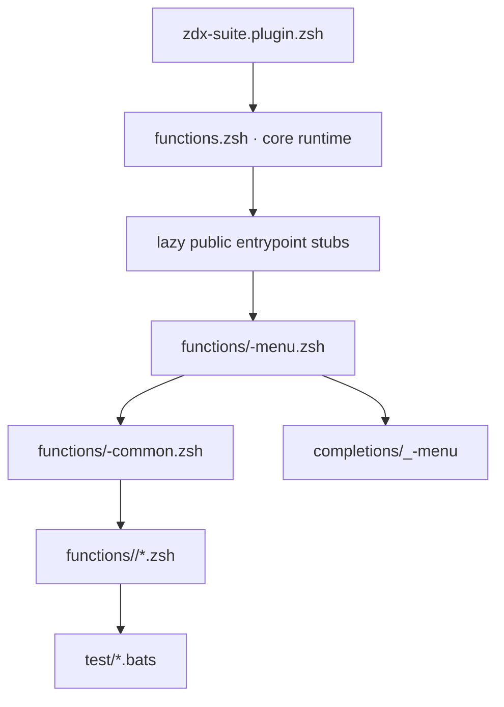

# Suites and ownership map

This is the authoritative inventory of shipped ZDX suites, entrypoints, and
ownership boundaries. Use [`development.md`](development.md) for the engineering
contract and [`menu-spec.md`](menu-spec.md) for interactive UI behavior.

The initial `v0.1.0` release contains 251 public commands across the 15 suites
below. Core commands and compatibility registrations are listed separately.
See [`CHANGELOG.md`](../CHANGELOG.md) for the release scope.

Local installation and Oh My Zsh activation are defined separately in
[`installation.md`](installation.md); the installer is not a runtime suite
or an additional updater.

## Runtime architecture

The core runtime owns configuration loading, shared theme, lazy registration,
timing/telemetry, plugin discovery, and user overrides. It does not own
suite-specific business logic.

Suite-owned picker wrappers use the optional core theme at invocation time
and retain a standalone fallback. The master groups destinations for discovery;
it does not take over their workflows. The rendering contract and validation
limits are described in [`menu-spec.md`](menu-spec.md) and
[`menu-design.md`](menu-design.md).

A suite owns its entrypoint, common primitives, feature modules, completion,
tests, and user-facing documentation as one public interface.

## Built-in suites

| Suite | Owned workflow | Entrypoint | Common | Feature modules | Capability notes |
| --- | --- | --- | --- | --- | --- |
| `git` | Local Git repositories and GitHub repository workflows | `git-menu` | `git-common.zsh` | `git/` | Requires Git; selected remote actions require authenticated `gh`; see [`git-menu.md`](git-menu.md) |
| `ws` | Workspace profiles, identity routing, SSH aliases, and repository placement | `ws-menu` | `ws-common.zsh` | `ws/` | Domain-coupled to Git identity; see [`ws-menu.md`](ws-menu.md) for the frozen surface, path boundary, and safety record |
| `vpn` | WireGuard profiles, access, connection state, and WSL DNS handling | `vpn-menu` | `vpn-common.zsh` | `vpn/` | Linux and WSL only unless `VPN_CONFIG_DIR` is set; see [`vpn-menu.md`](vpn-menu.md) for the platform contract, privilege model, and preview design |
| `docker` | Containers, images, Compose stacks, registry login, and Docker cleanup | `docker-menu` | `docker-common.zsh` | `docker/` | Binds mutations to one reviewed daemon context and exact resource records; see [`docker-menu.md`](docker-menu.md) |
| `sys` | Host diagnostics, packages, services, ports, processes, fonts, dotfiles, and cleanup | `sys-menu` | `sys-common.zsh` | `sys/` | Capability-gated; see [`sys-menu.md`](sys-menu.md) for the portability and safety contract |
| `file` | Archives, checksums, permissions, and file operations | `file-menu` | `file-common.zsh` | `file/` | Mutations stay below the current directory; hardened extraction is GNU TAR-only; see [`file-menu.md`](file-menu.md) |
| `app` | Discovery and execution of project task descriptors | `app-menu` | `app-common.zsh` | `app/` | Requires descriptor hashing plus only the backend selected for execution; see [`app-menu.md`](app-menu.md) |
| `ci` | GitHub Actions monitoring and repository CI cleanup | `ci-menu` | `ci-common.zsh` | `ci/` | Requires a repository, authenticated `gh`, bounded JSON parsing, and explicit write authorization; see [`ci-menu.md`](ci-menu.md) |
| `env` | Environment variables, dotenv files, PATH inspection, and profiles | `env-menu` | `env-common.zsh` | `env/` | Dotenv is passive data, values are never previewed, and persisted profiles are private; see [`env-menu.md`](env-menu.md) |
| `py` | Python runtimes, virtual environments, PyPI packages, and global tools | `py-menu` | `py-common.zsh` | `py/` | Owns validated project-local venvs, uv runtimes, project package backends, and isolated tools; see [`py-menu.md`](py-menu.md) |
| `dev` | Project checks, updates, reports, exports, security, and cleanup | `dev-menu` | `dev-common.zsh` | `dev/` | Capability-gated per toolchain; see [`dev-menu.md`](dev-menu.md) for the frozen surface, cleanup safety model, and remote-code policy |
| `net` | Network state, interfaces, DNS, latency, public IP, and throughput | `net-menu` | `net-common.zsh` | `net/` | Network access is command-specific, bounded, and privacy-visible; throughput requires authorization; see [`net-menu.md`](net-menu.md) |
| `gpu` | NVIDIA GPU telemetry and process occupancy | `gpu-menu` | `gpu-common.zsh` | `gpu/` | Hardware probes require `nvidia-smi` plus `timeout`/`gtimeout`; simulation is explicit; see [`gpu-menu.md`](gpu-menu.md) |
| `hf` | Hugging Face search, downloads, and local cache lifecycle | `hf-menu` | `hf-common.zsh` | `hf/` | Requires an installed compatible `huggingface_hub`; see [`hf-menu.md`](hf-menu.md) |
| `ai` | Local AI CLI inspection, quarantine, configuration, logs, updates, and MCP audits | `ai-menu` | `ai-common.zsh` | `ai/` | Cache roots are quarantined, installed-CLI updates require a reviewed remote-code decision, and snapshots/MCP data have explicit trust boundaries; see [`ai-menu.md`](ai-menu.md) |

Capability notes describe constraints, not a support guarantee. Each public
command performs its own checks as required by `development.md`.

## Core commands and compatibility registrations

| Component | Public command | Ownership |
| --- | --- | --- |
| Master router | `zdx`, `zdx-menu` | Loads adjacent `zdx-common.zsh`, maps fixed suite names to entrypoints, and renders the master menu |
| Plugin manager | `zdx-plugins` | Installs, validates, updates, lists, and removes user plugins |
| Dependency doctor | `zdx-doctor` | Reports command capabilities, version-probe failures, and passive display/source diagnostics; installation is always opt-in |
| Local compatibility registration | `zdir`, alias `wsj` | Recognizes an ignored user-local implementation; no implementation ships in the release artifact |
| Local compatibility registration | `zclean` | Recognizes an ignored user-local implementation; no implementation ships in the release artifact |

These are not generic helper namespaces. Release-owned private functions use
`_zdx_*`. Ignored local compatibility implementations remain outside the
repository contract and assurance surface.

## Ownership boundaries

### Git and workspace identity

The current `ws` implementation sources parts of the Git toolkit because a
workspace profile controls Git identity, SSH host aliases, and `includeIf`
routing. This is the only accepted cross-suite legacy coupling.

New code MUST NOT add more `ws -> git` private-helper dependencies. When this
area is refactored, shared identity primitives should move into an explicit
domain module consumed by both suites. Git repository operations remain owned
by `git`; workspace directory and profile lifecycle remain owned by `ws`.
The exact current boundary, including repository-placement orchestration and
the remaining compatibility adapters, is recorded in
[`ws-menu.md`](ws-menu.md).

### Project maintenance, environments, and containers

The `dev` suite owns project-scoped maintenance for the working directory:
dependency specifiers, lockfiles, quality gates, tests, security scans,
distribution artifacts, and project-local cleanup.

It does not own the resources it can reach. Virtual environment and Python
runtime lifecycle belongs to `py`, so the nine `venv-*` entries in the Dev menu
forward to the project-local contract in [`py-menu.md`](py-menu.md). Runtime
installation without an existing `.venv` is delegated there too. Dev retains
only its narrow, locked project-maintenance transaction for replacing an
existing `.venv`; it is not a second general lifecycle surface. Docker
pruning belongs to `docker`, so `clean-docker` and
`docker-prune-all` remain only as deprecated bridges to `docker-menu
docker-clean` and are absent from the Dev menu, help, and completion. Host
package managers belong to `sys`, so `dev-update-terraform` reports the owning
manager rather than upgrading it.

A forwarded command is a documented delegation. New work MUST NOT reintroduce a
`dev`-local implementation of a delegated lifecycle. `dev-update-toolchain`
forwards the narrowly scoped host `uv` update to `sys-menu update-uv-system`
and never invokes ambient `pip`. Terraform and TFLint package-manager updates
are reported with their owning `sys-menu` workflow rather than executed by
`dev`; those ownership claims must match the canonical active executable.

### WireGuard and the host

The `vpn` suite owns the WireGuard lifecycle: profile files, tunnel state, the
default and last-used pointers, and the WSL resolver and IPv6 workarounds.

It does not own the host around it. Installing `wireguard-tools` belongs to
`zdx-doctor`; packages and services belong to `sys`; connectivity diagnostics
beyond the tunnel and its exit belong to `net`. The suite targets Linux and WSL
and refuses other hosts with an explicit next step unless the user sets
`VPN_CONFIG_DIR`, which is read as a deliberate opt-in.

### Plugins

The core plugin manager, `zdx-plugins`, owns the plugin lifecycle.
`sys-plugins` remains only as a compatibility bridge: it loads the core owner
when needed and forwards all arguments. It MUST NOT regain an independent
plugin contract, implementation, or storage format.

The master's custom section and completion show only valid, available plugins
already loaded in the shell; that membership is not a source-review attestation.
The plugin manager shares the rendering wrapper policy, but its legacy capture
and lifecycle limitations remain separate. See [`plugins.md`](plugins.md) and
[`security-assessment.md`](security-assessment.md) for the trust boundary.

### Telemetry

The core runtime records opt-in execution telemetry with validated fields,
bounded retention, owner-only state, locking, and atomic replacement.
`sys-telemetry` provides the System-oriented viewer and hardened clear
operation for that core data. A suite may label its timed commands, but it MUST
NOT implement a second telemetry writer or schema.

### Dependency installation

Suites own capability checks for their workflows. `zdx-doctor` owns the
cross-suite dependency report and installation assistant. A suite may explain
how to install a missing dependency, but it must not silently install it.

## Allowed dependency graph

| Caller | May depend on | Must not depend on |
| --- | --- | --- |
| Core runtime | configuration, Zsh modules, documented external core tools | suite common files or feature modules |
| Suite entrypoint | core runtime contract, own common, own feature modules | another suite's private helpers |
| Suite common | core runtime contract, Zsh builtins/modules | public workflows or another suite common |
| Feature module | own common, documented core services | unrelated feature modules with hidden load-order assumptions |
| Plugin | its own code and declared external commands | undocumented built-in private helpers |

When two modules need ordering, the entrypoint states it explicitly and the
dependent module names the exact prerequisite in its header.

## Module split rules

Keep an entrypoint focused on loading, routing, and the top-level menu. Create a
feature module when any of these is true:

- the feature has a distinct external dependency or platform boundary;
- it manages persisted state or destructive operations;
- it needs a dedicated test fixture or mock backend;
- it forms a coherent group of public commands;
- keeping it in the entrypoint would obscure routing and menu review.

Do not split only to meet an arbitrary line count. Conversely, do not keep a
large file intact when it contains several unrelated safety models. A module
name describes owned behavior, not a historical menu section.

## Public command inventory rules

For every suite, the following surfaces are one contract:

- public functions;
- direct subcommands accepted by `<suite>-menu`;
- dispatcher arms;
- menu action records;
- `--help` output;
- completion entries;
- runtime completion registration, including the `zdx <suite>` wrapper;
- BATS contract tests;
- end-user documentation.

Renaming or removing a command requires searching all nine surfaces. A
compatibility alias must have a removal plan and delegate to the canonical
owner.

## Prefix conventions

| Owner | Private prefix |
| --- | --- |
| Core runtime and master router | `_zdx_*` |
| Git | `_git_*` |
| Workspace | `_ws_*` |
| VPN | `_vpn_*` |
| Docker | `_docker_*` |
| System | `_sys_*` |
| File | `_file_*` |
| App | `_app_*` |
| CI | `_ci_*` |
| Environment | `_env_*` |
| Python | `_py_*` |
| Developer | `_dev_*` |
| Network | `_net_*` |
| GPU | `_gpu_*` |
| Hugging Face | `_hf_*` |
| AI | `_ai_*` |

`_tk_*` is a legacy compatibility prefix currently split between core theme
helpers and the Git common toolkit. New helpers MUST use their real owner
prefix. Code MUST NOT assume an arbitrary `_tk_*` function is globally safe.

## Adding a suite

A new built-in suite requires all of the following in one coherent change:

1. A distinct ownership statement that does not duplicate an existing suite.
2. `functions/<suite>-menu.zsh` and `<suite>-common.zsh` following the loader
   and header contracts.
3. Feature modules split by capability and safety boundary where needed.
4. Registration in the core lazy loader and `zdx` router.
5. A Zsh completion file.
6. BATS tests for sourcing, help, dispatch, cancellation, and core workflows.
7. Entries in this inventory and `user-guide.md`.
8. A security-assessment update if it adds a trust boundary, persisted file,
   privileged action, network surface, or external code execution.
9. `zdx-doctor` capability metadata for new external dependencies.
10. A passing `just check`.

Roadmap presence does not reserve ownership or waive these requirements.

## When to add a suite-specific document

Add a separate document only when a suite exposes a protocol, file format,
trust model, or operational workflow that cannot be expressed clearly in its
code header and `user-guide.md` section. General command lists belong in help,
completion, tests, and the user guide rather than in a second drifting catalog.
