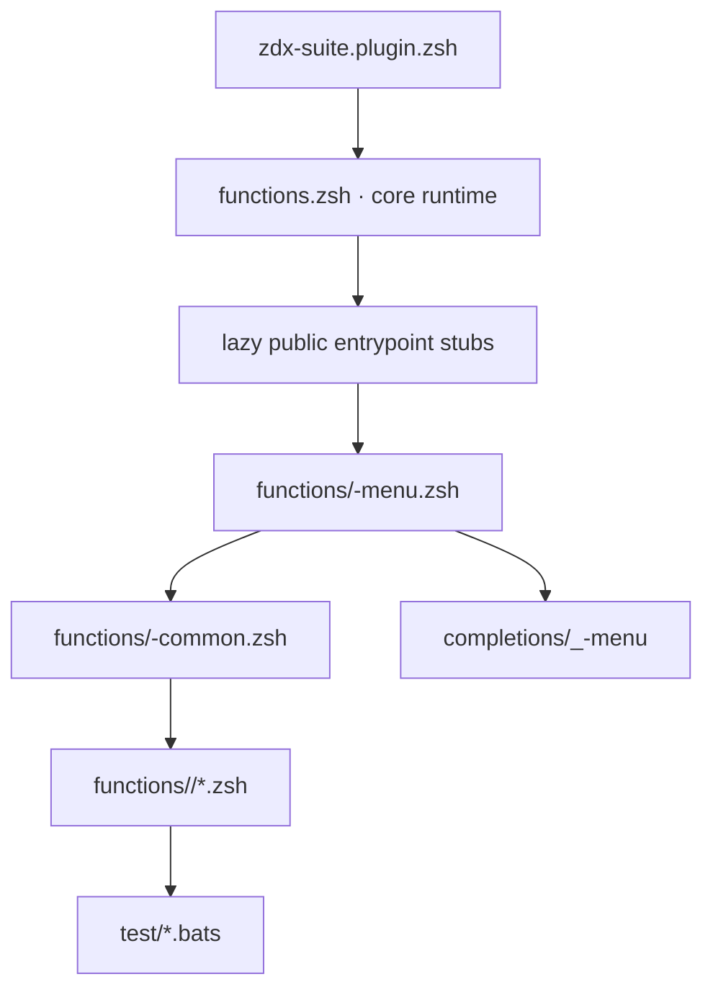

# Suites and ownership map

This is the authoritative inventory of shipped ZDX suites, entrypoints, and
ownership boundaries. Use [`development.md`](development.md) for the engineering
contract and [`menu-spec.md`](menu-spec.md) for interactive UI behavior.

ZDX `v0.1.0` contains 120 public commands across the eight suites below:
Git 21, Developer 25, System 25, VPN 22, Python 16, File 5, Workspace 3, and
Environment 3. Each suite's frozen list lives in `test/fixtures/<suite>-public-commands.tsv`.
Core commands and local registrations are listed separately. See
[`CHANGELOG.md`](../CHANGELOG.md) for the release notes.

Local installation and Oh My Zsh activation are defined separately in
[`installation.md`](installation.md); the installer is not a runtime suite
or an additional updater.

## Runtime architecture

```mermaid
flowchart TD
    plugin["zdx-suite.plugin.zsh"] --> core["functions.zsh · core runtime"]
    core --> lazy["lazy public entrypoint stubs"]
    lazy --> menu["functions/<suite>-menu.zsh"]
    menu --> common["functions/<suite>-common.zsh"]
    common --> modules["functions/<suite>/*.zsh"]
    menu --> completion["completions/_<suite>-menu"]
    modules --> tests["test/*.bats"]
```

The core runtime owns configuration loading, shared theme, command-output
services, lazy registration, timing/telemetry, plugin discovery, and user
overrides. It does not own suite-specific business logic.

Suite-owned picker wrappers use the optional core theme at invocation time
and retain a standalone fallback. The master groups destinations for discovery;
it does not take over their workflows. The rendering contract and validation
limits are described in [`menu-spec.md`](menu-spec.md) and
[`menu-design.md`](menu-design.md).

A suite owns its entrypoint, common primitives, feature modules, completion,
tests, and user-facing documentation as one public interface.

## Built-in suites

| Suite | Owned workflow | Entrypoint | Common | Feature modules | Capability notes |
| --- | --- | --- | --- | --- | --- |
| `ws` | The `$WS_BASE_DIR/<platform>/<identity>/<repository>` workspace layout: navigation, clone placement, and multi-repository status | `ws-menu` | `ws-common.zsh` | `ws/` | Requires Git 2.31 or newer; `fd` is optional; `--json` needs `jq`; identity profiles are applied through `git-menu`; see [`ws-menu.md`](ws-menu.md) |
| `git` | Local Git repositories, local changes, and GitHub pull-request workflows | `git-menu` | `git-common.zsh` | `git/` | Requires Git 2.31 or newer; selected remote actions require authenticated `gh`; see [`git-menu.md`](git-menu.md) |
| `vpn` | WireGuard profiles, access, connection state, and WSL DNS handling | `vpn-menu` | `vpn-common.zsh` | `vpn/` | Linux, WSL, and macOS (Homebrew `wireguard-tools`); other hosts only with `VPN_CONFIG_DIR`; see [`vpn-menu.md`](vpn-menu.md) for the platform contract, privilege model, and preview design |
| `sys` | Host diagnostics, packages, services, ports, processes, cleanup, and telemetry | `sys-menu` | `sys-common.zsh` | `sys/` | Capability-gated; see [`sys-menu.md`](sys-menu.md) for the portability and safety contract |
| `file` | Archives, large-file inspection, the File trash, and junk-file cleanup | `file-menu` | `file-common.zsh` | `file/` | Mutations stay below the current directory, except moves into and out of the private trash; hardened extraction needs GNU tar as `tar` or `gtar`; see [`file-menu.md`](file-menu.md) |
| `env` | Masked environment variables, PATH inspection, and read-only dotenv checks | `env-menu` | `env-common.zsh` | `env/` | Values are never printed or previewed; PATH changes only through an explicit reviewed deduplication; dotenv files are parsed as data and never loaded; see [`env-menu.md`](env-menu.md) |
| `py` | Python runtimes, virtual environments, PyPI packages, and global tools | `py-menu` | `py-common.zsh` | `py/` | Owns validated project-local venvs, uv runtimes, project package backends, and isolated tools; see [`py-menu.md`](py-menu.md) |
| `dev` | Project checks, updates, reports, security, and cleanup | `dev-menu` | `dev-common.zsh` | `dev/` | Capability-gated per toolchain; see [`dev-menu.md`](dev-menu.md) for the frozen surface, cleanup safety model, and remote-code policy |

Capability notes describe constraints, not a support guarantee. Each public
command performs its own checks as required by `development.md`.

## Platform support

Every built-in suite runs on Linux, WSL, and macOS. macOS runs with its BSD
userland and Homebrew tools. The platform rules for new code are in
[`development.md`](development.md#platform-behavior), and each suite contract
records its full platform matrix and what only mocks verify.

| Suite | WSL | macOS |
| --- | --- | --- |
| `ws` | A workspace root on a Windows drive is refused for clones unless WSL mounts it with DrvFs metadata; an `ssh.exe` in `core.sshCommand` resolves workspace SSH aliases | BSD `find` or Homebrew `fd` discovers repositories; clones are published with BSD `mv -n` and an identity check; Apple's `/usr/bin/git` placeholder is refused |
| `git` | A repository on a Windows drive gets a speed and line-ending advisory; identity profiles keep an inherited `ssh.exe` and pass it profile keys as Windows paths converted with `wslpath -w` | Apple's `/usr/bin/git` placeholder is reported, not run; with `core.ignorecase`, as on APFS and Windows drives, obstacle checks and new refs compare names without letter case |
| `vpn` | DNS hardening, and the IPv6 rewrite only under NAT networking or without an IPv6 default route; resolver pinning warns where `chattr` cannot hold, as on WSL1 | Homebrew `wireguard-tools` and Bash 4 or newer; each profile maps to its `utunN` device; the profile directory is selected, preferring the root-owned `/private/etc/wireguard` |
| `sys` | Windows programs on the appended `PATH` are skipped rather than run as Linux tools; `sys-info` adds the WSL generation and the Windows version; `sys-wsl` reviews `/etc/wsl.conf`, `.wslconfig`, the MTU, and the manual virtual-disk compaction steps | launchd, Homebrew, and `softwareupdate` without restart updates; `update-apt`, `update-snap`, `clean-journal`, `clean-snaps`, and `sys-wsl` report that they do not apply |
| `file` | Mutations and a trash on Windows drives are refused unless WSL mounts them with DrvFs metadata, with the `/etc/wsl.conf` remedy | Mount and trash same-filesystem checks compare device numbers; extraction needs Homebrew `gnu-tar` (`gtar`); 7z creation uses `7zz` from Homebrew `sevenzip` |
| `env` | `clip.exe` receives UTF-16 text, with a fixed `System32` fallback; a dotenv file on a Windows drive without DrvFs metadata gets the remedy for its mode `777` | `pbcopy` runs under a UTF-8 locale; Apple's placeholder `git` is never run by the dotenv check |
| `py` | Projects on Windows drives are refused with the DrvFs remedy | Inventories use `gtimeout` or the core watchdog; relocatable environments cannot be activated without `/proc`; python.org framework interpreters are accepted |
| `dev` | Windows launchers on the appended `PATH` count as missing; private state on a Windows drive needs DrvFs metadata | Apple's `git` and `python3` placeholders are never run; Homebrew ownership follows the prefix that owns each tool |

On every platform, Developer reads project metadata with Python 3.11 or newer,
which it finds automatically, and the dependency doctor shows rows that cannot
apply on the host as not applicable.

## Core commands and local registrations

| Component | Public command | Ownership |
| --- | --- | --- |
| Master router | `zdx`, `zdx-menu` | Loads adjacent `zdx-common.zsh`, maps fixed suite names to entrypoints, and renders the master menu |
| Plugin manager | `zdx-plugins` | Installs, validates, updates, lists, and removes user plugins |
| Status dashboard | `zdx status`, `zdx-status` | Read-only summary of the repository, project, VPN, host, and ZDX settings from bounded local probes, with a `zdx.status.v1` JSON form; it loads no suite and reports facts that suites own, such as workspace identity, without deciding them |
| Dependency doctor | `zdx-doctor` | Reports command capabilities, version-probe failures, and passive display/source diagnostics; installation is always opt-in |
| Insert widgets | ZLE widgets `zdx-insert-branch`, `zdx-insert-pr`, `zdx-insert-port`, `zdx-insert-venv` | Registered by the plugin wrapper in interactive shells and bound only to free chords; their bodies in `functions/zdx-widgets.zsh` load on first use and only insert a quoted value into the command line |
| Optional local registration | `zdir`, alias `wsj` | Registered only when an ignored user-local `functions/zdir.zsh` exists; no implementation ships in the release artifact |

These are not generic helper namespaces. Release-owned private functions use
`_zdx_*`. Ignored local implementations remain outside the repository
contract and assurance surface.

## Ownership boundaries

### Git and the workspace layout

The `ws` suite owns the `$WS_BASE_DIR/<platform>/<identity>/<repository>`
layout (`~/workspaces` by default): navigating between its repositories,
placing new clones, and a read-only status across them. It creates platform
and identity directories only inside a reviewed `ws-clone` plan.

The `git` suite owns repository operations, local changes (unstaging,
stashes, amending, and discarding), switching to existing or remote-tracking
branches and recovering unreachable commits as new branches, Git identity, and
GitHub pull-request workflows. For a repository below
`$WS_BASE_DIR/<platform>/<identity>` (`~/workspaces` by default), `git-auth`
also shows the matching SSH host alias, host name, and key fingerprint, and
`git-identity-check` compares the repository identity with the profile named
after the identity directory; the opt-in identity guard runs that check when a
directory change enters such a repository. These reads are display-only: Git
does not create, move, or remove workspace directories, profiles, or SSH
aliases, and it does not clone repositories into the layout.

The two suites share one naming convention, the `<platform>-<identity>` SSH
alias and the `.ws-hostname` file, and each keeps its own private
implementation of it. `ws-clone` applies an identity profile only by calling
the Git suite's public `git-menu git-identity-switcher --switch NAME local`;
it never writes Git configuration itself. Neither suite creates SSH aliases
or keys.

### Project maintenance and environments

The `dev` suite owns project-scoped maintenance for the working directory:
dependency specifiers, lockfiles, pre-commit hook revisions, the GitHub
Actions references of its workflows, quality gates, tests, security scans,
and project-local cleanup.

It does not own the resources it can reach. Virtual environment and Python
runtime lifecycle belongs to `py`: the Dev menu has no `venv-*` entries, and
`dev-update-python` delegates runtime installation without an existing
`.venv` to the project-local contract in [`py-menu.md`](py-menu.md). Dev
retains only its narrow, locked project-maintenance transaction for replacing
an existing `.venv`; it is not a second general lifecycle surface. Host
package managers belong to `sys`, so `dev-update-terraform` reports the owning
manager rather than upgrading it.

A delegation is documented forwarding, not a second implementation. New work
MUST NOT introduce a `dev`-local implementation of a delegated lifecycle or
a `dev` command that only forwards to another suite's public command. The
`dev-update-all` host toolchain step calls `sys-menu update-uv-system`
directly and never invokes ambient `pip`. Terraform and TFLint
package-manager updates are reported with their owning `sys-menu` workflow
rather than executed by `dev`; those ownership claims must match the
canonical active executable.

Operating-system junk files such as `*:Zone.Identifier`, `.DS_Store`, and
`Thumbs.db` appear in any directory, not only in projects, so the `file` suite
owns their removal through `file-clean-junk`; Dev cleanup plans no junk
category.

### Files and the trash

The `file` suite owns the ZDX trash, `${XDG_DATA_HOME:-~/.local/share}/zdx/trash`,
through `file-trash`: moving reviewed paths there by rename, its records,
restores, and purges. Other suites keep their own cleanup models; a suite
that wants a recoverable deletion delegates to `file-trash` rather than
writing to that directory. The desktop trash (`$XDG_DATA_HOME/Trash`) is not
ZDX state.

### WireGuard and the host

The `vpn` suite owns the WireGuard lifecycle: profile files, tunnel state, the
default and last-used pointers, the WSL resolver and IPv6 workarounds, and the
macOS mapping between wg-quick profiles and utun devices.

It does not own the host around it. Installing `wireguard-tools` belongs to
`zdx-doctor`, and packages and services belong to `sys`. Its diagnostics stop
at the tunnel and its exit; general connectivity diagnostics are outside the
suite. The suite targets Linux, WSL, and macOS and refuses other hosts with an
explicit next step unless the user sets `VPN_CONFIG_DIR`, which is read as a
deliberate opt-in.

### Plugins

The core plugin manager, `zdx-plugins`, owns the plugin lifecycle and is the
only plugin-management command. A suite MUST NOT add an independent plugin
contract, implementation, storage format, or compatibility bridge.

The master's custom section and completion show only valid, available plugins
already loaded in the shell; that membership is not a source-review attestation.
The plugin manager shares the rendering wrapper policy and the private picker
capture, and runs installs and updates as staged, trust-gated transactions.
See [`plugins.md`](plugins.md) and
[`security-assessment.md`](security-assessment.md) for the trust boundary.

### Telemetry

The core runtime records opt-in execution telemetry with validated fields,
bounded retention, owner-only state, locking, and atomic replacement.
`sys-telemetry` provides the System-oriented viewer and hardened clear
operation for that core data. A suite may label its timed commands, but it MUST
NOT implement a second telemetry writer or schema.

### Command output

The core runtime owns the command-output vocabulary and renderers defined in
[`output-spec.md`](output-spec.md): headings, key-value lines, step banners
and results, summary tables, durations, counted nouns, step result slots, and
captured child-tool output. Suites call them through thin `_<prefix>_*` wrappers with a
standalone fallback. A suite MUST NOT introduce a second outcome vocabulary,
duration format, or failure-capture service. Suite machine protocols stay
suite-owned and are mapped by their consumer.

### Dependency installation

Suites own capability checks for their workflows. `zdx-doctor` owns the
cross-suite dependency report and installation assistant. A suite may explain
how to install a missing dependency, but it must not silently install it.

## Allowed dependency graph

| Caller | May depend on | Must not depend on |
| --- | --- | --- |
| Core runtime | configuration, Zsh modules, documented external core tools | suite common files or feature modules |
| Suite entrypoint | core runtime contract, own common, own feature modules | another suite's private helpers |
| Suite common | core runtime contract, Zsh builtins/modules | public workflows or another suite common |
| Feature module | own common, documented core services | unrelated feature modules with hidden load-order assumptions |
| Plugin | its own code and declared external commands | undocumented built-in private helpers |

When two modules need ordering, the entrypoint states it explicitly and the
dependent module names the exact prerequisite in its header.

## Module split rules

Keep an entrypoint focused on loading, routing, and the top-level menu. Create a
feature module when any of these is true:

- the feature has a distinct external dependency or platform boundary;
- it manages persisted state or destructive operations;
- it needs a dedicated test fixture or mock backend;
- it forms a coherent group of public commands;
- keeping it in the entrypoint would obscure routing and menu review.

Do not split only to meet an arbitrary line count. Conversely, do not keep a
large file intact when it contains several unrelated safety models. A module
name describes owned behavior, not a historical menu section.

## Public command inventory rules

For every suite, the following surfaces are one contract:

- public functions;
- direct subcommands accepted by `<suite>-menu`;
- dispatcher arms;
- menu action records;
- `--help` output;
- completion entries;
- runtime completion registration, including the `zdx <suite>` wrapper;
- BATS contract tests;
- end-user documentation.

Renaming or removing a command requires searching all nine surfaces. A
compatibility alias must have a removal plan and delegate to the canonical
owner. `just surfaces` reports which surfaces each command has, and
`just new-command` scaffolds the uniform ones for a new command; see
[`development.md`](development.md#adding-a-public-command).

## Prefix conventions

| Owner | Private prefix |
| --- | --- |
| Core runtime and master router | `_zdx_*` |
| Git | `_git_*` |
| VPN | `_vpn_*` |
| System | `_sys_*` |
| File | `_file_*` |
| Environment | `_env_*` |
| Python | `_py_*` |
| Developer | `_dev_*` |
| Workspace | `_ws_*` |

`_tk_*` is a legacy compatibility prefix that remains only on a few core
runtime helpers in `functions.zsh`, such as the `_tk_fzf_color_opts` theme
helper. New helpers MUST use their real owner prefix. Code MUST NOT assume an
arbitrary `_tk_*` function is globally safe.

## Adding a suite

A new built-in suite requires all of the following in one coherent change:

1. A distinct ownership statement that does not duplicate an existing suite.
2. `functions/<suite>-menu.zsh` and `<suite>-common.zsh` following the loader
   and header contracts.
3. Feature modules split by capability and safety boundary where needed.
4. Registration in the core lazy loader and `zdx` router.
5. A Zsh completion file.
6. BATS tests for sourcing, help, dispatch, cancellation, and core workflows.
7. Entries in this inventory and `user-guide.md`.
8. A security-assessment update if it adds a trust boundary, persisted file,
   privileged action, network surface, or external code execution.
9. `zdx-doctor` capability metadata for new external dependencies.
10. A passing `just check`.

Roadmap presence does not reserve ownership or waive these requirements.

## When to add a suite-specific document

Add a separate document only when a suite exposes a protocol, file format,
trust model, or operational workflow that cannot be expressed clearly in its
code header and `user-guide.md` section. General command lists belong in help,
completion, tests, and the user guide rather than in a second drifting catalog.
